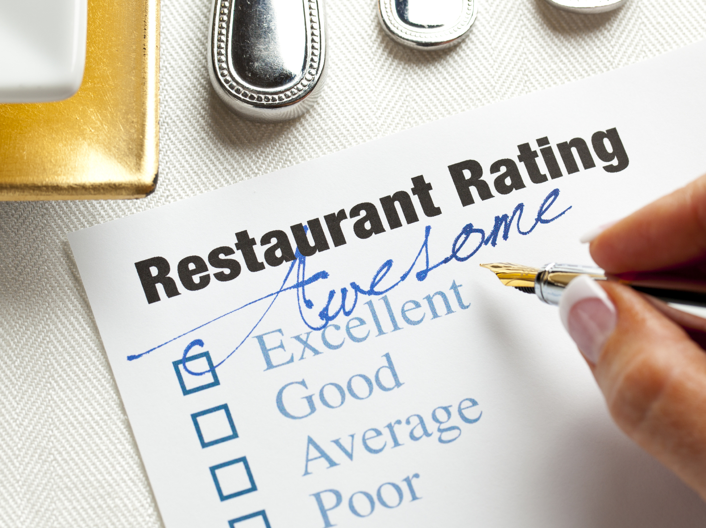

### Natural Language Process in Restaurant Review

## Project Status: [Completed]

## Project Intro/Objective
The purpose of this project is to build a classifier to classify a new given review into positive or negative. Classification is a supervised Machine Learning problem. It specifies the class to which data elements belong to and is best used when the output has finite and discrete values.

Can we use detect what type of review is negative or positive ?

## Methods Used
Machine Learning
Natural Language Process
Python
Stemming
Bag of Words
Naive Bayes

## Project Description

(Provide more detailed overview of the project. Talk a bit about your data sources and what questions and hypothesis you are exploring. What specific data analysis/visualization and modelling work are you using to solve the problem? What blockers and challenges are you facing? Feel free to number or bullet point things here)

**Raw Dataset **: "Restaurant_Reviews.tsv"

## Data processing/transformation and  Model training technique
**1. Stemming:**
Stemming is the process of producing morphological variants of a root/base word.
Some more example of stemming for root word "like" include:

-> "likes"
-> "liked"
-> "likely"
-> "liking"

**2. Bag of Words Model **
In this model, a text (such as a sentence or a document) is represented as the bag (multiset) of its words, disregarding grammar and even word order but keeping multiplicity.

**3. Naivee Bayes Model**
Naive Bayes methods are a set of supervised learning algorithms based on applying Bayes’ theorem with the “naive” assumption of conditional independence between every pair of features given the value of the class variable. Bayes’ theorem states the following relationship, given class variable  and dependent feature vector

**4. Confusion Matrix**
a specific table layout that allows visualization of the performance of an algorithm

## Result
that is for 71.2% times the classifier was able to correctly predict review was positive or negative.

